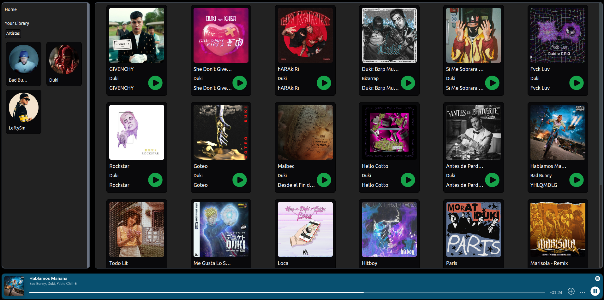

<div align="center">
    <h1>Colne Spotify</h1>
    
</div>

##

Es un proyecto que realize para practicar ReactJS:

- Vista previa de la Aplicacion



## Como ejecutar

- Comandos

```bash
npm install       # Instala las dependencias
npm run dev       # Inicia la aplicación
```
**¡Importante!**: Es necesario el Bearer Token de Spotify

*Nota*: Consiguelo en el suiguiente enlace.

- https://developer.spotify.com
